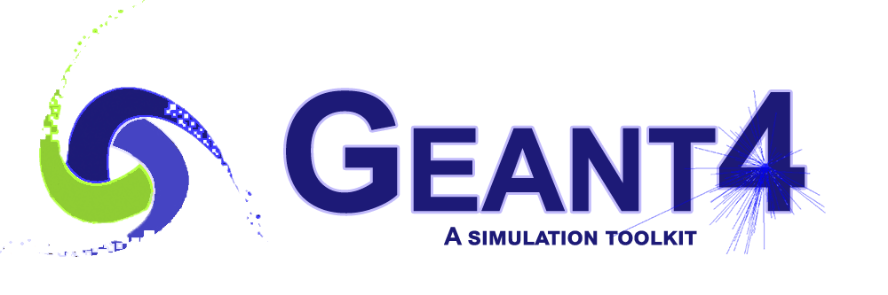

<!--
*** Thanks for checking out this README Template. If you have a suggestion that would
*** make this better, please fork the repo and create a pull request or simply open
*** an issue with the tag "enhancement".
*** Thanks again! Now go create something AMAZING! :D
***
***
***
*** To avoid retyping too much info. Do a search and replace for the following:
*** github_username, repo, twitter_handle, email
-->

<!-- PROJECT LOGO -->
 

  

  <h3 align="center">Geant4 Cargo Scanning Monte-Carlo Simulation</h3>

  

An aluminum cargo container with various objects inside is exposed mega-voltage gammas, neutrons, and muons.
     
     

<!-- TABLE OF CONTENTS -->
## Table of Contents

* [Project Report](#about-the-project)
* [License](#license)
* [Contact](#contact)

<!-- ABOUT THE PROJECT -->
## Project Report
A brief project report was written which provide a description of the parts of this simulation, the primary references used, and also some acknowledgements.

The report can be found:

<!-- CONTACT -->
## Contact

Ruiheng Su - ruihengsu@alumni.ubc.ca

Project Link: [https://github.com/sillyPhotons/G4_Cargo](https://github.com/sillyPhotons/G4_Cargo)
